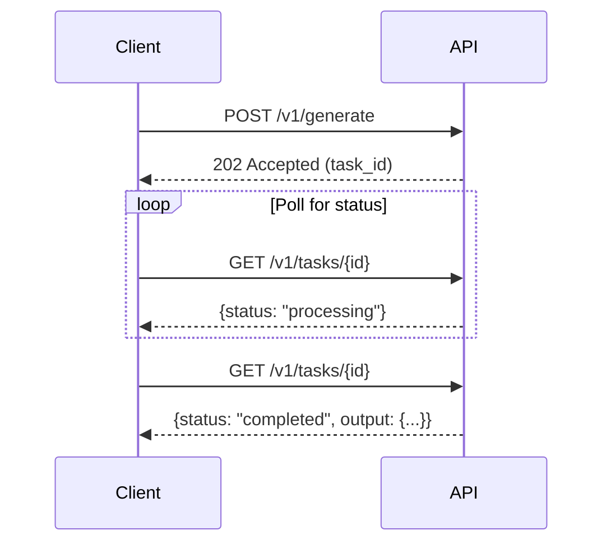

## Asynchronous Models

Egg API uses asynchronous generation for all current models:

| Model | Type | Response |
|-------|------|----------|
| `nanobanana` | Asynchronous | Task ID returned, poll for results |
| `nanobanana-pro` | Asynchronous | Task ID returned, poll for results |
| `veo3.1` | Asynchronous | Task ID returned, poll for results |

## Async Workflow

For async models (all current models), you need to:

1. **Submit** - Create a generation task
2. **Poll** - Check the task status periodically
3. **Retrieve** - Get the results when complete



## Step 1: Submit a Task

Submit your generation request:

```bash
curl -X POST https://api.eggapi.ai/v1/generate \
  -H "Authorization: Bearer YOUR_API_KEY" \
  -H "Content-Type: application/json" \
  -d '{
    "model": "veo3.1",
    "prompt": "A cat playing with a ball of yarn",
    "duration": 5,
    "aspect_ratio": "16:9"
  }'
```

**Response (202 Accepted):**

```json
{
  "data": {
    "id": "gen_abc123def456",
    "status": "pending",
    "model": "veo3.1",
    "type": "video_generate",
    "cost": "$0.00",
    "created_at": "2024-01-15T10:30:00Z"
  },
  "error": null
}
```

## Webhook Notifications (Optional)

If you don't want to poll, include `webhook_url` when you create the task. Egg API will POST to your URL when the task completes or fails.

```bash
curl -X POST https://api.eggapi.ai/v1/generate \
  -H "Authorization: Bearer YOUR_API_KEY" \
  -H "Content-Type: application/json" \
  -d '{
    "model": "veo3.1",
    "prompt": "A cat playing with a ball of yarn",
    "duration": 5,
    "aspect_ratio": "16:9",
    "webhook_url": "https://example.com/eggapi/webhook"
  }'
```

### Headers

- `Content-Type: application/json`
- `X-EggAPI-Timestamp`: Unix timestamp (seconds)
- `X-EggAPI-Signature`: Optional. `sha256=` + HMAC-SHA256(hex), signing `{timestamp}.{raw_body}`

<Note>
  The signature header is only sent after you generate a Webhook Secret in the dashboard.
</Note>

### Payload Example

```json
{
  "event": "task.completed",
  "task_id": "gen_abc123def456",
  "status": "completed",
  "model": "veo3.1",
  "output": {
    "url": "https://cdn.eggapi.ai/outputs/abc123.mp4",
    "duration_seconds": 5
  },
  "error": null,
  "cost": "0.400000",
  "timestamp": 1705314690
}
```

When the task fails:

```json
{
  "event": "task.failed",
  "task_id": "gen_abc123def456",
  "status": "failed",
  "model": "veo3.1",
  "error": "Content moderation: prompt contains prohibited content",
  "cost": "0.000000",
  "timestamp": 1705314690
}
```

### Signature Verification

```python
import hashlib
import hmac

def verify(signature, timestamp, raw_body, secret):
    message = f"{timestamp}.{raw_body}".encode("utf-8")
    expected = "sha256=" + hmac.new(
        secret.encode("utf-8"),
        message,
        hashlib.sha256,
    ).hexdigest()
    return hmac.compare_digest(signature, expected)
```

<Note>
  Use the raw request body for verification. Re-serializing JSON will break the signature.
</Note>

### Retry Policy

- 2xx is treated as success
- Up to 5 retries with exponential backoff (max 4 hours)
- 30s timeout per request

## Step 2: Poll for Status

Check the task status periodically:

```bash
curl https://api.eggapi.ai/v1/tasks/gen_abc123def456 \
  -H "Authorization: Bearer YOUR_API_KEY"
```

### Task Statuses

| Status | Description |
|--------|-------------|
| `pending` | Task is queued, waiting to start |
| `processing` | Task is being processed |
| `completed` | Task finished successfully |
| `failed` | Task failed |

### Processing Response

```json
{
  "data": {
    "id": "gen_abc123def456",
    "status": "processing",
    "model": "veo3.1",
    "type": "video_generate",
    "cost": "$0.00",
    "created_at": "2024-01-15T10:30:00Z",
    "started_at": "2024-01-15T10:30:05Z"
  },
  "error": null
}
```

## Step 3: Get Results

When status is `completed`:

```json
{
  "data": {
    "id": "gen_abc123def456",
    "status": "completed",
    "model": "veo3.1",
    "type": "video_generate",
    "output": {
      "url": "https://cdn.eggapi.ai/outputs/abc123.mp4",
      "duration_seconds": 5
    },
    "cost": "$0.4000",
    "created_at": "2024-01-15T10:30:00Z",
    "started_at": "2024-01-15T10:30:05Z",
    "completed_at": "2024-01-15T10:31:30Z"
  },
  "error": null
}
```

## Polling Best Practices

### Recommended Polling Interval

- Start polling after 3-5 seconds
- Poll every 5 seconds for videos
- Use exponential backoff if needed

### Example Implementation

<CodeGroup>

```python Python
import requests
import time

def wait_for_task(task_id, api_key, max_wait=300):
    """Wait for an async task to complete."""
    url = f"https://api.eggapi.ai/v1/tasks/{task_id}"
    headers = {"Authorization": f"Bearer {api_key}"}

    start_time = time.time()
    poll_interval = 5

    while time.time() - start_time < max_wait:
        response = requests.get(url, headers=headers)
        task = response.json()["data"]

        if task["status"] == "completed":
            return task

        if task["status"] == "failed":
            raise Exception(f"Task failed: {task['error']}")

        print(f"Status: {task['status']}...")
        time.sleep(poll_interval)

    raise Exception("Task timed out")

# Usage
task = wait_for_task("gen_abc123", "YOUR_API_KEY")
print(f"Video URL: {task['output']['url']}")
```

```javascript JavaScript
async function waitForTask(taskId, apiKey, maxWait = 300000) {
  const url = `https://api.eggapi.ai/v1/tasks/${taskId}`;
  const headers = { "Authorization": `Bearer ${apiKey}` };

  const startTime = Date.now();
  const pollInterval = 5000;

  while (Date.now() - startTime < maxWait) {
    const response = await fetch(url, { headers });
    const { data: task } = await response.json();

    if (task.status === "completed") {
      return task;
    }

    if (task.status === "failed") {
      throw new Error(`Task failed: ${task.error}`);
    }

    console.log(`Status: ${task.status}...`);
    await new Promise(resolve => setTimeout(resolve, pollInterval));
  }

  throw new Error("Task timed out");
}

// Usage
const task = await waitForTask("gen_abc123", "YOUR_API_KEY");
console.log("Video URL:", task.output.url);
```

</CodeGroup>

## Handling Failures

When a task fails, the response includes an error message:

```json
{
  "data": {
    "id": "gen_abc123def456",
    "status": "failed",
    "error": "Content moderation: prompt contains prohibited content",
    ...
  },
  "error": null
}
```

Common failure reasons:
- Content moderation violations
- Invalid prompt
- Provider issues (our system automatically retries with backup providers)

<Note>
  Egg API automatically handles provider failures by retrying with backup providers. You typically won't see provider-related failures unless all providers are unavailable.
</Note>

## Listing Tasks

View all your tasks with pagination:

```bash
curl "https://api.eggapi.ai/v1/tasks?page=1&per_page=20" \
  -H "Authorization: Bearer YOUR_API_KEY"
```

This is useful for:
- Building task dashboards
- Tracking generation history
- Debugging issues
